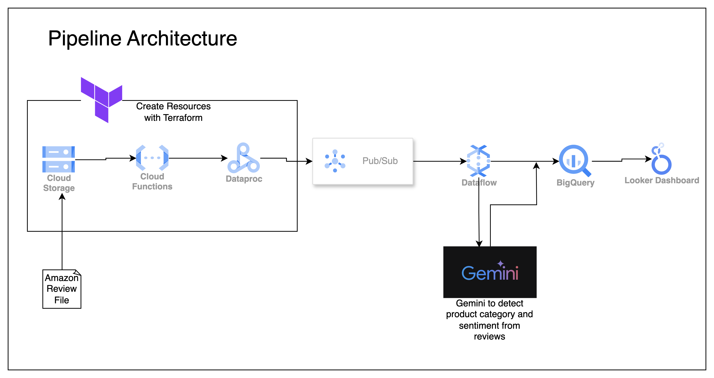

# NPS-Amazon-Reviews

This pipeline performs sentiment analysis in form of Net Promoter Score(Rating) and category detection on amazon reviews using Gemini

The flow of the pipeline is 
- Create resources using Terraform(GCS bucket, cloud function, Pubsub, dataproc cluster)
- Trigger cloud function when the review file is dropped into a GCS bucket
- Cloud function submits a dataproc job to created cluster
- Dataproc job streams review file to a pubsub topic
- Dataflow pull data from pubsub subscription and sends customer review to Gemini API
- Gemini determines the product category & product name, and performs sentiment analysis on review text by categorizing reviews into [Promoter,Passives,Distractors]
- New data is streamed into BQ
- BQ data is Visualized to more insights

